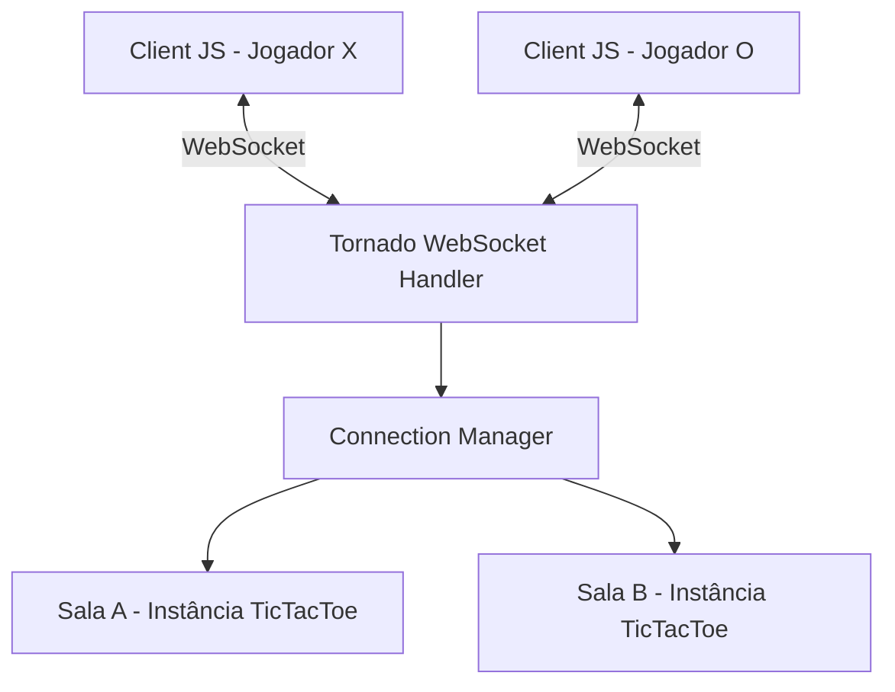
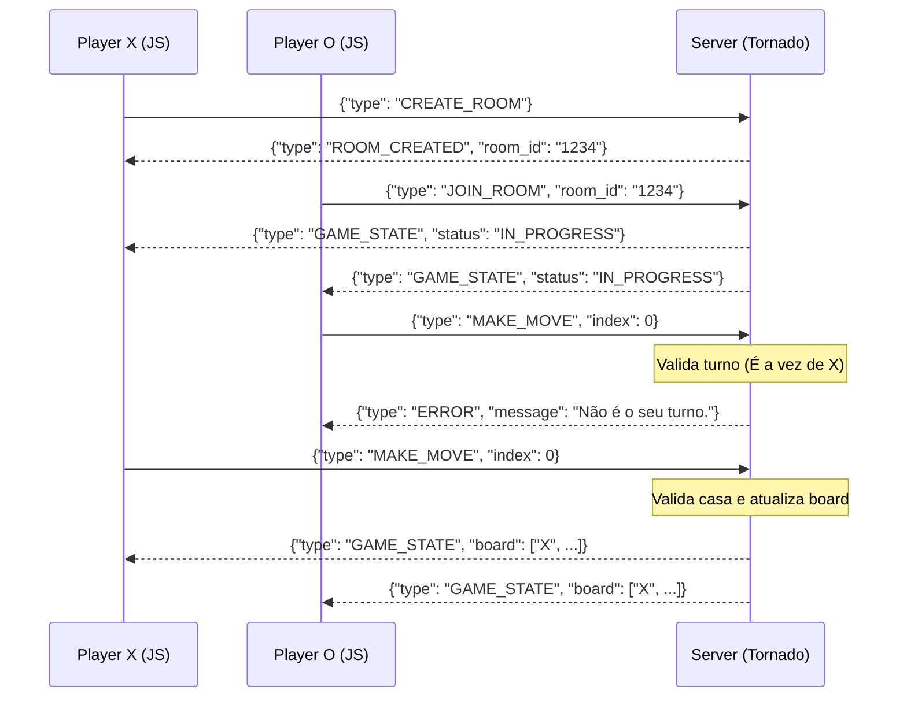

# Tech Spec — Implementação do Servidor de Jogo da Velha (WebSocket)

## Visão geral da arquitetura
A aplicação adota uma arquitetura Client-Server via WebSocket. O servidor em Tornado atua como a "Fonte da Verdade" (Source of Truth). Ele mantém o estado em memória das salas, o mapeamento das posições no tabuleiro e de quem é o turno. O Client apenas emite intenções de ação (ex: "quero jogar na casa 2") e reage passivamente às atualizações de estado do servidor para renderizar a interface.



## Componentes / módulos afetados
- **`main.py`**: Ponto de entrada do Tornado. Configura rotas, a porta do servidor, inicializa a aplicação web e o loop de eventos (IOLoop).
- **`handlers/game_handler.py`**: Herda de `tornado.websocket.WebSocketHandler`. Lida com os callbacks assíncronos `open`, `on_message` e `on_close`. Mapeia as mensagens JSON para chamadas no `ConnectionManager`.
- **`game/connection_manager.py`**: Singleton ou classe gestora do ciclo de vida das salas. Cria salas (com códigos únicos), adiciona jogadores, identifica quem é X e O, e remove salas em caso de fechamento de abas ou abandono.
- **`game/tic_tac_toe.py`**: A lógica de domínio pura (State Machine). Não contém conhecimento sobre WebSockets. Possui o grid 3x3, valida movimentos (garantindo que não pode jogar no turno do outro nem sobrepor casas), e computa vitórias ou empates.
- **`messages/serializer.py` e `messages/types.py`**: Uso de `dataclasses` para padronizar e tipar as mensagens JSON, prevenindo que um input "malformado" do frontend exploda a aplicação no backend.

## Contratos (APIs, mensagens, dados)
As comunicações serão envelopes JSON baseados no campo `type`.

**Client -> Server (Intenções)**
- `CREATE_ROOM`: `{"type": "CREATE_ROOM", "player_name": "Gabriel"}`
- `JOIN_ROOM`: `{"type": "JOIN_ROOM", "room_id": "ABCDEF", "player_name": "Pedro"}`
- `MAKE_MOVE`: `{"type": "MAKE_MOVE", "index": 4}`
- `RESTART_GAME`: `{"type": "RESTART_GAME"}`
- `LEAVE_ROOM`: `{"type": "LEAVE_ROOM"}`

**Server -> Client (Eventos e Estados)**
- `ROOM_CREATED`: `{"type": "ROOM_CREATED", "room_id": "ABCDEF"}`
- `GAME_STATE` (Emitido sempre que algo muda na sala):
```json
{
  "type": "GAME_STATE",
  "room_id": "ABCDEF",
  "board": ["X", null, null, "O", "X", null, null, null, null],
  "current_turn": "X",
  "status": "WAITING_OPPONENT | IN_PROGRESS | FINISHED",
  "players": {"X": "Gabriel", "O": "Pedro"},
  "winner": null,
  "scores": {"X": 0, "O": 0}
}
```
- `ERROR`: `{"type": "ERROR", "message": "Turno do adversário!"}` (Para rejeitar jogadas como a descrita no PRD).

## Fluxo de execução



## Decisões técnicas e alternativas consideradas
- **Decisão:** Lógica do jogo (TicTacToe) completamente isolada de bibliotecas web (Tornado).
  **Motivo:** Facilita enormemente a escrita de testes unitários síncronos, limpos e segue princípios de Domain Driven Design (separação de negócio vs infraestrutura).
  **Alternativa descartada:** Colocar a verificação de "quem ganhou" diretamente dentro do `on_message` do `WebSocketHandler`, o que geraria código acoplado e de difícil manutenção.

## Impacto em testes
- Precisaremos escrever testes automatizados para `game/tic_tac_toe.py`, verificando todos os cenários estritos: vitória em linha, coluna e diagonal; detecção de empate; bloqueio de movimento fora do turno ou em casa preenchida.
- Testes para o `connection_manager.py` validando que jogadores não conseguem entrar em salas cheias ou jogar quando o outro foi desconectado.
