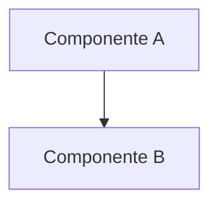
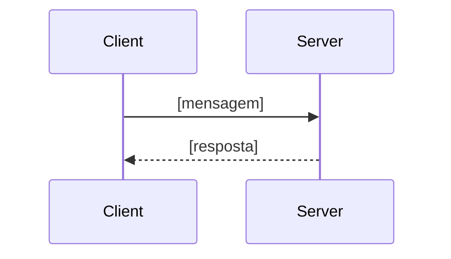

# Tech Spec — [Nome da Demanda]

## Visão geral da arquitetura
[Resumo de como as peças se encaixam]

## Componentes / módulos afetados
- **[módulo]**: [responsabilidade]

## Contratos (APIs, mensagens, dados)
[Formato de entrada/saída, ex: JSON de mensagens WebSocket, assinaturas de função]

## Fluxo de execução

## Decisões técnicas e alternativas consideradas
- **Decisão:** [o que foi escolhido]
  **Motivo:** [por quê]
  **Alternativa descartada:** [o que não foi usado e por quê]

## Impacto em testes
[O que precisa ser coberto por testes automatizados]
